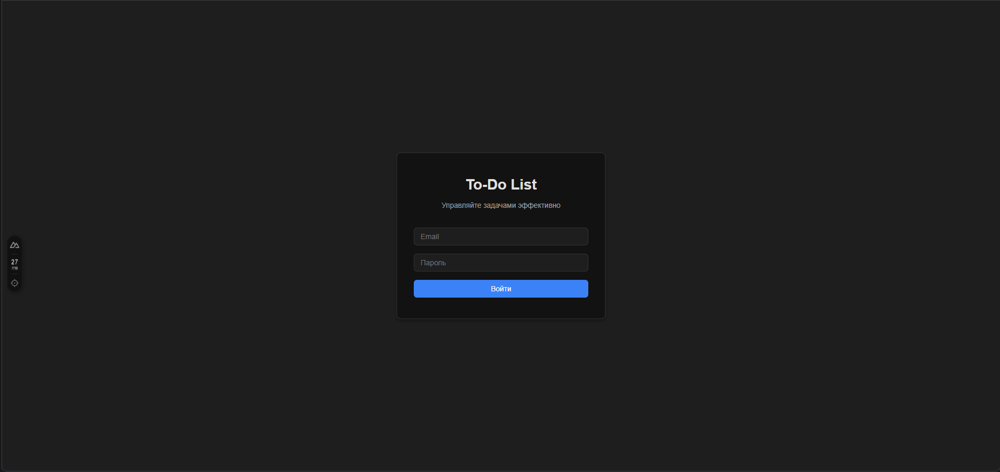
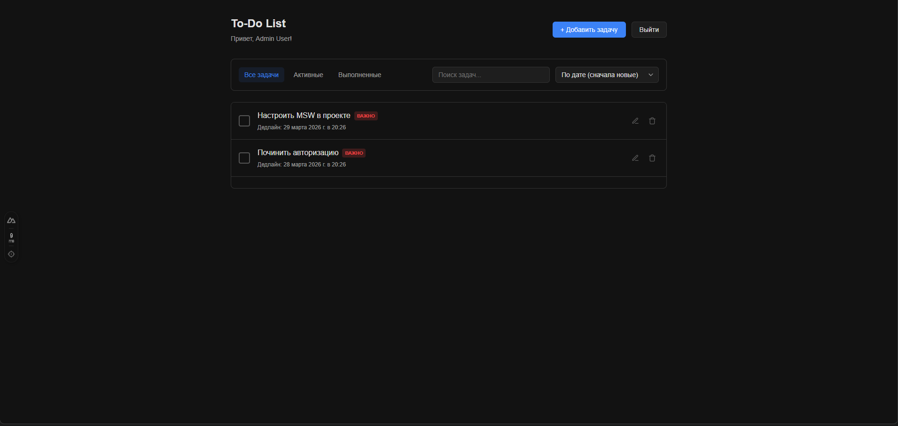
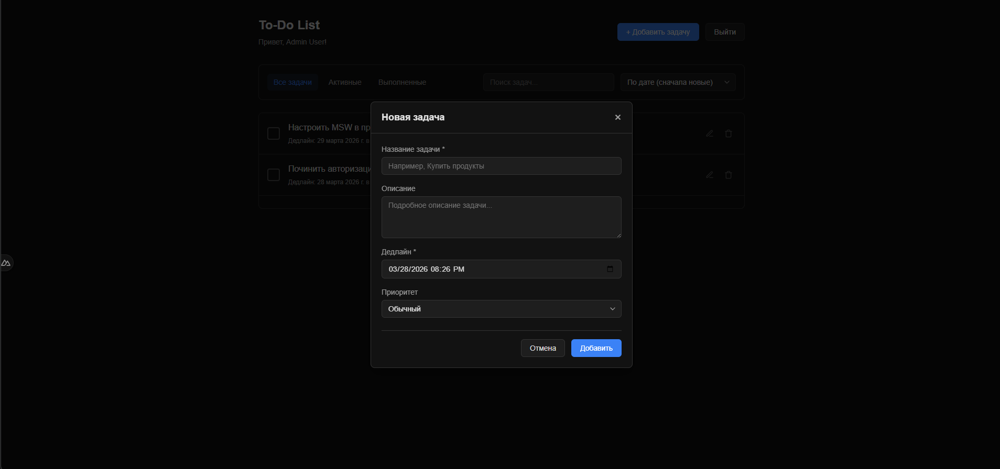

# 📝 To-Do List — Frontend Test Task

Мини-приложение «Список задач», реализованное на **Nuxt**. 
Проект полностью изолирован от реального бэкенда благодаря **MSW (Mock Service Worker)**, что позволяет эмулировать полноценный REST API прямо в браузере.

---

## 📸 Скриншоты интерфейса

### Страница авторизации


### Дашборд пользователя


### Модальное окно создания / редактирования


---

## 🚀 Технологии

- **Фреймворк:** Nuxt (Vue 3, TypeScript)
- **HTTP Клиент:** Axios
- **Мокирование API:** MSW (Mock Service Worker)
- **Стейт-менеджер:** Pinia
- **Стилизация:** SCSS

---

## ⚙️ Установка и Запуск

Выполните следующие шаги для локального запуска проекта.

### 1. Установка зависимостей

Убедитесь, что у вас установлен `Node.js` (рекомендуется версия 18+).

```bash
# Установка NPM-пакетов
npm install
```

### 2. Настройка .env файла

В корне проекта присутствует файл `.env.example`. Создайте его копию и назовите `.env`:

```bash
cp .env.example .env
```

В режиме разработки все запросы будут перехватываться MSW локально. 
Однако файл `.env` необходим для будущего развертывания проекта в продакшн, когда вы подключите реальный REST бэкенд (ASP.NET, Node.js или иной). Выглядеть он должен так:

```env
NUXT_PUBLIC_API_BASE_URL="https://api.example.com/api"
```

### 3. Запуск проекта

```bash
# Запуск dev-сервера
npm run dev
```

Приложение будет доступно по адресу [http://localhost:3000](http://localhost:3000).  
Откройте консоль браузера (F12) — вы должны увидеть следующее сообщение от сервиса моков: `[MSW] Mocking enabled.`

---

## 👤 Тестовые пользователи

В приложении предустановлены 2 аккаунта:

| Email | Пароль | Роль | Возможности |
| :--- | :--- | :--- | :--- |
| `admin@test.com` | `123456` | Admin | Может редактировать/удалять любые задачи |
| `user@test.com` | `123456` | User | Может редактировать/удалять только свои задачи |

---

## 📡 API Эндпоинты (Моки MSW)

Вся логика перехватывается с помощью MSW. Базовый префикс запросов — `/api`. 
*Для всех защищенных маршрутов Axios плагин (`app/plugins/axios.ts`) автоматически подставляет заголовок `Authorization: Bearer <token>`.*

### 🔑 Авторизация
- **`POST /api/auth/login`**  
  *Авторизация пользователя. Возвращает объект пользователя и JWT токен (который затем надежно сохраняется в `localStorage`).*  
  **Payload:** `{ "email": "admin@test.com", "password": "..." }`

### 📋 Управление задачами (CRUD)
- **`GET /api/tasks`**  
  *Получение списка задач. Поддерживает пагинацию, сортировку и поиск.*  
  **Параметры:** `?page=1&limit=10&status=active&sortBy=date_desc&search=купить`

- **`POST /api/tasks`**  
  *Создание новой задачи.*  
  **Payload:** `{ "title": "Новая задача", "description": "Детали...", "dueDate": "...", "priority": "normal" }`

- **`PUT /api/tasks/:id`**  
  *Редактирование задачи (разрешено владельцу или администратору, иначе ошибка 403).*  

- **`DELETE /api/tasks/:id`**  
  *Удаление задачи (разрешено владельцу или администратору).*

---

## 💡 Примечание по архитектуре
В данном проекте Server-Side Rendering (SSR) был отключен в файле конфигурации `nuxt.config.ts`.  
Это не является ошибкой: так как хранение токенов производится в браузере (`localStorage`), а MSW работает исключительно на клиентской стороне, отключение SSR полностью исключает ошибки гидратации (Hydration Mismatch) и позволяет запускать проект как классическое, отточенное SPA (Single Page Application).
